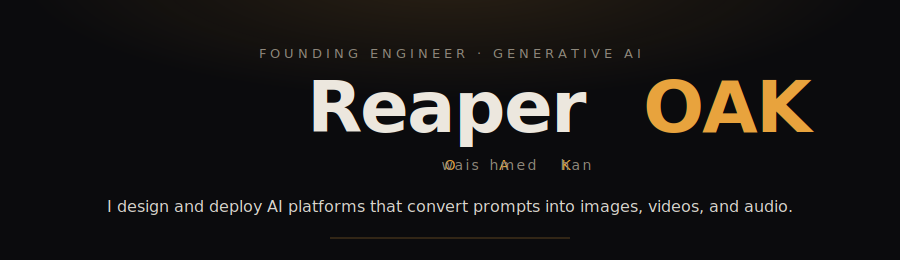

<!-- section:hero -->

<picture>
  <source media="(prefers-color-scheme: dark)" srcset="assets/hero-dark.svg">
  <source media="(prefers-color-scheme: light)" srcset="assets/hero-light.svg">
  
</picture>

---

<!-- section:currently -->
### Currently

- **Building** [Pindow](https://pindow.ai) and [Crosbird](https://www.crosbird.com/) at Cornflakes Media.
- **This cycle** — This week: refreshed the profile README, added a README generator app in TypeScript with 36 tests, and generated an oak-themed profile README with a dual-theme SVG hero.
- **Thinking about** — Exploring the balance between model complexity and interpretability in AI systems to enhance both performance and user trust.

---

<!-- section:featured -->
### Featured

| Project | What it solves | Stack |
|---------|----------------|-------|
| **[Pindow ↗](https://pindow.ai)** | Turns prompts into image, video, and audio across 15+ foundation models. | `FastAPI · NestJS · Java · React · AWS` |
| **[Crosbird ↗](https://www.crosbird.com/)** | Cross-platform influencer marketplace with escrow, split payouts, and discovery. | `Expo · React Native · NestJS · OpenSearch` |
| **[ForgeOS](https://github.com/ReaperOAK/ForgeOS)** | An SDLC engine of orchestrated agents for spec-driven development. | `TypeScript` |
| **[CodebaseRAG](https://github.com/ReaperOAK/CodebaseRAG)** | Local RAG over any repository via an MCP server for instant querying. | `JavaScript · LLMs · MCP` |
| **[survivorship-free-backtester](https://github.com/ReaperOAK/survivorship-free-backtester)** | Honest, survivorship-bias-corrected, tax-aware backtesting on free data. | `Python · DuckDB` |

---

<!-- section:engine-room -->
### The Engine Room

- **Languages** — TypeScript · JavaScript · Python · PHP · Java
- **Frontend** — React · React Native · Next.js · Expo · Tailwind / NativeWind
- **Backend** — NestJS · FastAPI · Node.js · Express · Socket.io · BullMQ
- **Generative AI** — Claude / GPT / Gemini · Prompt engineering · fal.ai · ElevenLabs · Multimodal
- **Cloud & DevOps** — AWS (EC2/RDS/ElastiCache/S3/Lambda) · Docker · Kubernetes · GitHub Actions
- **Data & Payments** — PostgreSQL · MySQL · MongoDB · Redis · OpenSearch · Stripe · Razorpay · Cashfree

---

<!-- section:numbers -->
### Selected numbers

`1.2M+` clicks served  ·  `28K+` monthly active users  ·  `15+` foundation models  ·  `~95%` test coverage  ·  `<100ms` API responses

---

<!-- section:stats -->

<picture>
  <source media="(prefers-color-scheme: dark)" srcset="assets/stats-dark.svg">
  <source media="(prefers-color-scheme: light)" srcset="assets/stats-light.svg">
  
</picture>

---

<!-- section:connect -->
### Connect

[Portfolio](https://reaperoak.web.app/) • [LinkedIn](https://linkedin.com/in/owaistech) • [Email](mailto:oaak78692@gmail.com)

---

<!-- section:coda -->

125R, throttle open  ·  writes poetry  ·  optimizes the economy before attacking

