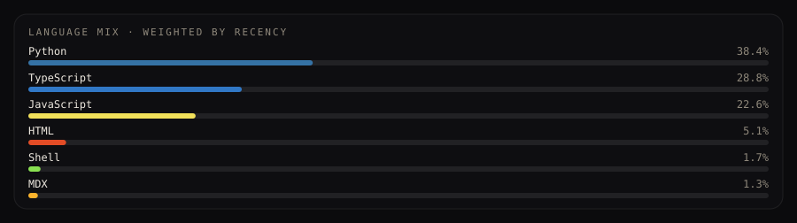
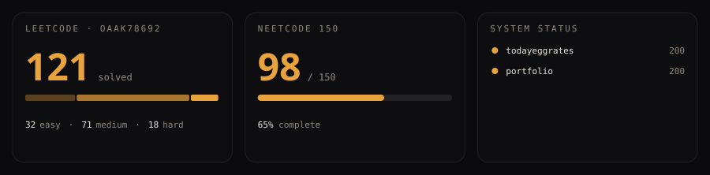

<!-- section:hero -->

<picture>
  <source media="(prefers-color-scheme: dark)" srcset="assets/hero-dark.svg">
  <source media="(prefers-color-scheme: light)" srcset="assets/hero-light.svg">
  
</picture>

---

<!-- section:currently -->
### Currently

- **Building** a GenAI Media Platform and a Creator Marketplace at Cornflakes Media.
- **This cycle** — This week: completed the app with delete, new, and view functionality using Express, Mongoose, and EJS.
- **Thinking about** — Considering how to isolate stateful inference workloads in a multi‑tenant Kubernetes cluster without sacrificing latency.

---

<!-- section:craft -->

<picture>
  <source media="(prefers-color-scheme: dark)" srcset="assets/craft-dark.svg">
  <source media="(prefers-color-scheme: light)" srcset="assets/craft-light.svg">
  
</picture>

---

<!-- section:arena -->

<picture>
  <source media="(prefers-color-scheme: dark)" srcset="assets/arena-dark.svg">
  <source media="(prefers-color-scheme: light)" srcset="assets/arena-light.svg">
  
</picture>

---

<!-- section:featured -->
### Featured

| Project | What it solves | Stack |
|---------|----------------|-------|
| **GenAI Media Platform** | Generative-AI media platform orchestrating foundation models for image, video, and audio. | `FastAPI · NestJS · Java · React · AWS` |
| **Creator Marketplace** | Cross-platform creator marketplace for web, iOS, and Android. | `Expo · React Native · NestJS` |
| **[ForgeOS](https://github.com/ReaperOAK/ForgeOS)** | An SDLC engine of orchestrated agents for spec-driven development. | `TypeScript · Python · JavaScript` |
| **[csefarewell2k25](https://github.com/ReaperOAK/csefarewell2k25)** |  | `TypeScript · Python · HTML` |
| **[vibecoding](https://github.com/ReaperOAK/vibecoding)** |  | `Python · HTML · Shell` |
| **[portfolio](https://github.com/ReaperOAK/portfolio)** |  | `JavaScript · TypeScript · MDX` |

---

<!-- section:cases -->
### Case studies

<b>survivorship-free-backtester</b> — <code>Python · DuckDB · yfinance · NSE bhavcopy</code>

**Problem** — Retail backtests test the past using today's winning stocks. The bias is invisible and it inflates every result.

**Decision** — Reconstructed point-in-time Nifty 100/200/500 membership from the Internet Archive, recovered delisted-loser prices, and re-ran every strategy against the honest universe. Lot-level FIFO on top, with real Indian tax (20% STCG / 12.5% LTCG).

**Tradeoff** — The correction destroyed the headline. Momentum's Sharpe fell from ~1.5 to ~1.0, and after tax the high-turnover strategies barely beat buy-and-hold. Publishing that was the point.

**Outcome** — Survivorship inflates momentum by +0.4 to +0.9 Sharpe. Ensemble + regime-cash roughly halves drawdown, −38% to ~−18% — insurance, not free alpha. Intraday dip-buying died under honest testing.

[Open survivorship-free-backtester ↗](https://github.com/ReaperOAK/survivorship-free-backtester)

<b>todayeggrates</b> — <code>JavaScript · MDX · PHP</code>

**Problem** — Daily commodity rates that people actually check, which means the site is worthless the day it goes stale.

**Decision** — Content as MDX so rates and long-form pages ship through the same pipeline, with SEO treated as a build-time concern rather than a plugin.

**Tradeoff** — MDX made the build heavier and the content model stricter than a CMS would have. Bought two years of uninterrupted daily updates without an editor UI to maintain.

[Open todayeggrates ↗](https://todayeggrates.com/)

<b>ForgeOS</b> — <code>TypeScript · Python · PostgreSQL</code>

**Problem** — Agents given a whole codebase and a vague goal produce plausible output and unreviewable diffs.

**Decision** — Split the SDLC into stage-specific agents with explicit handoffs and a ticket lifecycle, so each stage has one job and a reviewable artifact.

**Tradeoff** — Far more orchestration machinery than a single-agent loop, and every stage boundary is a place work can stall. Bought traceability from vision to diff.

[Open ForgeOS ↗](https://github.com/ReaperOAK/ForgeOS)

---

<!-- section:roadmap -->
### Deliberate practice

| Track | What that means | Progress |
|---|---|---|
| **System design** | Distributed scheduling, consensus, failure detectors | ongoing |
| **NeetCode 150** | Pattern coverage, one directory per problem | `███████░░░` 98 / 150 |

---

<!-- section:engine-room -->
### The Engine Room

- **Languages · measured** — Python 38% · TypeScript 29% · JavaScript 23% · HTML 5% · Shell 2% · MDX 1%
- **Frontend** — React · React Native · Next.js · Expo · Tailwind / NativeWind
- **Backend** — NestJS · FastAPI · Node.js · Express · Socket.io · BullMQ
- **Generative AI** — Claude / GPT / Gemini · Prompt engineering · fal.ai · ElevenLabs · Multimodal
- **Cloud & DevOps** — AWS (EC2/RDS/ElastiCache/S3/Lambda) · Docker · Kubernetes · GitHub Actions
- **Data & Payments** — PostgreSQL · MySQL · MongoDB · Redis · OpenSearch · Stripe · Razorpay · Cashfree

---

<!-- section:numbers -->
### Selected numbers

`3 yrs` shipping production systems  ·  `4` engineers led  ·  `7M+` search impressions served  ·  `~90%` DB load cut by caching  ·  `<100ms` API responses

---

<!-- section:how -->
### How I work

- Every external dependency is optional. If a provider is down the product degrades, it does not break.
- A number without a method behind it is decoration. Publish the correction, not just the result.
- Tests describe behaviour, not implementation. A refactor that breaks the suite means the suite was wrong.
- Ship the smallest thing that can be measured, then measure it.

---

<!-- section:connect -->
### Connect

[Portfolio](https://portfolio.owaiskhan.website/) • [LinkedIn](https://linkedin.com/in/owaistech) • [Email](mailto:oaak78692@gmail.com)

---

<!-- section:coda -->

125R, throttle open  ·  writes poetry  ·  optimizes the economy before attacking

